# Thread Schedulers from scratch

This repository houses multiple experimental thread scheduler implementations written to educate myself on the topic.

- [Thread Schedulers from scratch](#thread-schedulers-from-scratch)
  - [Overview](#overview)
  - [Results](#results)
    - [Sequential](#sequential)
    - [Static scheduler](#static-scheduler)
    - [Dynamic Scheduler](#dynamic-scheduler)

## Overview

There are 4 subfolders, as explained below -

- `numerical_integration` - sequential implementation of numerical integration
- `sequential` - benches numerical integration sequentially.
- `static` - performs numerical in parallel via `pthreads` via a custom static scheduler
- `dynamic` - performs numerical integration in parallel via `pthreads` via a custom dynamic scheduler

The computation performed is the numerical integration, more information can be found [here](https://en.wikipedia.org/wiki/Numerical_integration).

## Results

### Sequential

### Static scheduler

- It can be observed that as the n increases, the speedup in case of thread method increases. This could be because the number of iterations for each thread increases and every thread needs a mutex only to update the result. But in the iteration method, each thread can update the result anytime after it finishes its iteration, however, other threads will have to wait until it releases its mutex after it completes the iteration and hence it has a low speedup. As the proportion of parallel to serial execution increases, greater will be the speedup as the number of processors increases.
- According to the plot, when the intensity is low and n increases, speedup remains constant no matter how much the number of threads increase. There is one fixed time overhead, which is getting the mutex and running the function. When there is larger dataset and as the n increases along with the function cost, the speedup will also increase. Since the intensity is low, the function cost is less and hence the speedup is also less. So even if the n increases, the function cost is still less and so is the speedup.
- The speedup of thread-level synchronization increases as n increases. But that’s not the case in iteration-level synchronization. As the parallel to serial execution increases, the speedup will also grow as the number of processors increase. Greater the parallelism, greater will be the speedup. In thread-level synchronization, each thread needs a mutex to update the result after it completes its iteration. In  iteration-level synchronization, each thread waits for the other thread to release its mutex after it finishes its iteration which will take a while longer to compute and hence it has comparatively less speedup.

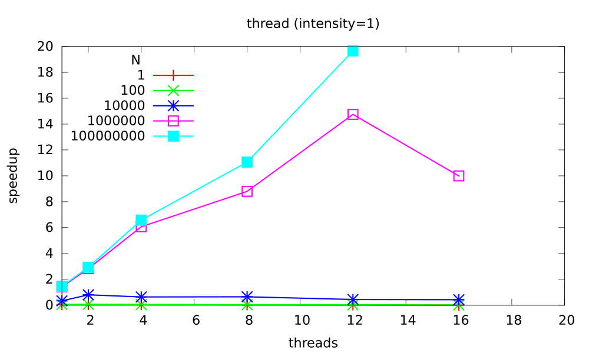
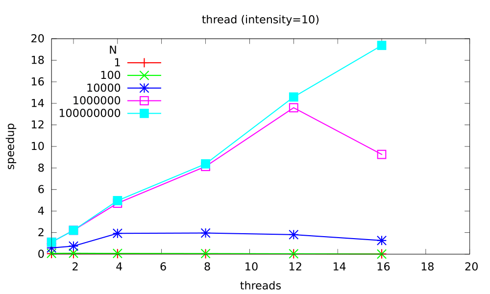
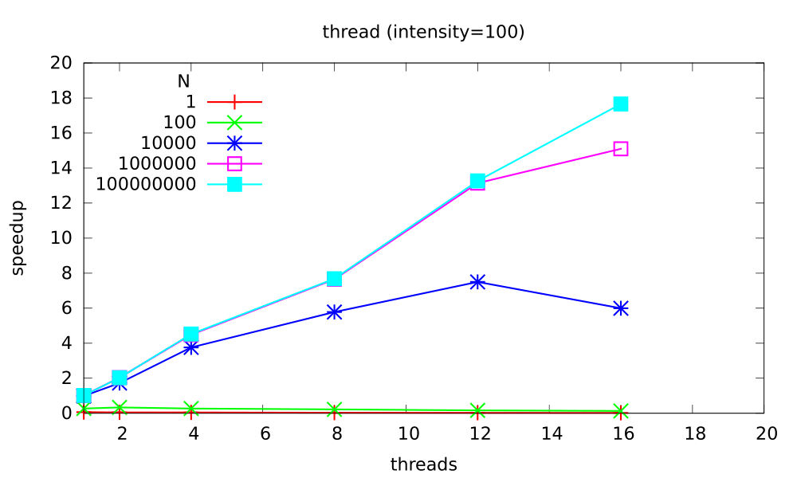
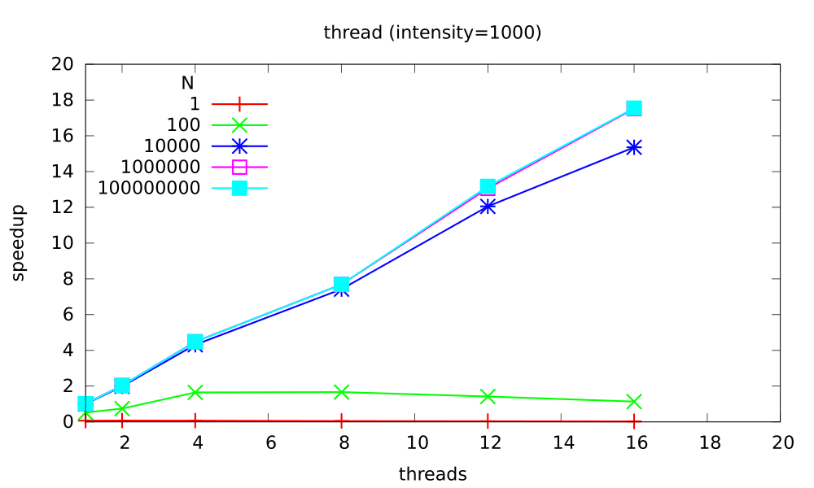

### Dynamic Scheduler

- It can be observed that performance decreases as granularity increases. Less granularity meaning less work which causes less computational time for each processors. This  leads to more overhead as every thread accesses mutex for a short period of time so as the number of thread increase, so does the overhead. That’s the reason for low speedup. Whereas more granularity could lead to better computational time for each processors but performance decreases as more threads are involved for every iteration and each of them use mutexes. The speedup is high because it is inversely proportional to parallel time. 
- In the thread level synchronization, as the intensity increases, the cost of function also increases. Which means the work increases leading to more computational time for each thread. To achieve maximum speedup, the granularity should decrease in equal proportion. This also indicates that as the granularity decreases in gradual proportions, the speedup increases. This is to maintain load balancing between threads.  

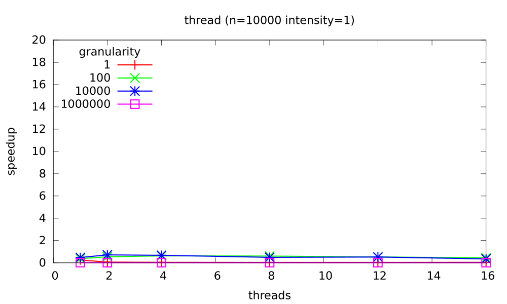
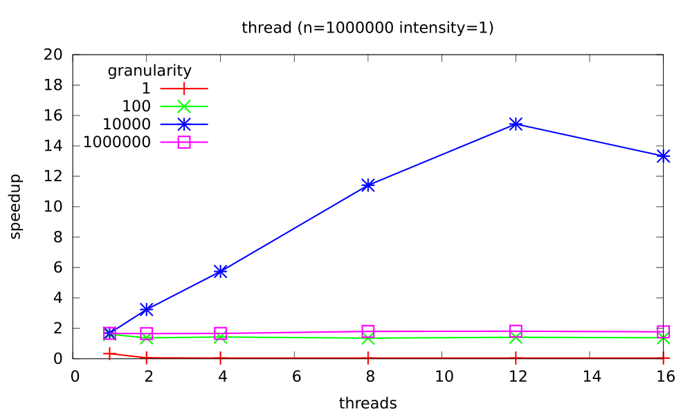
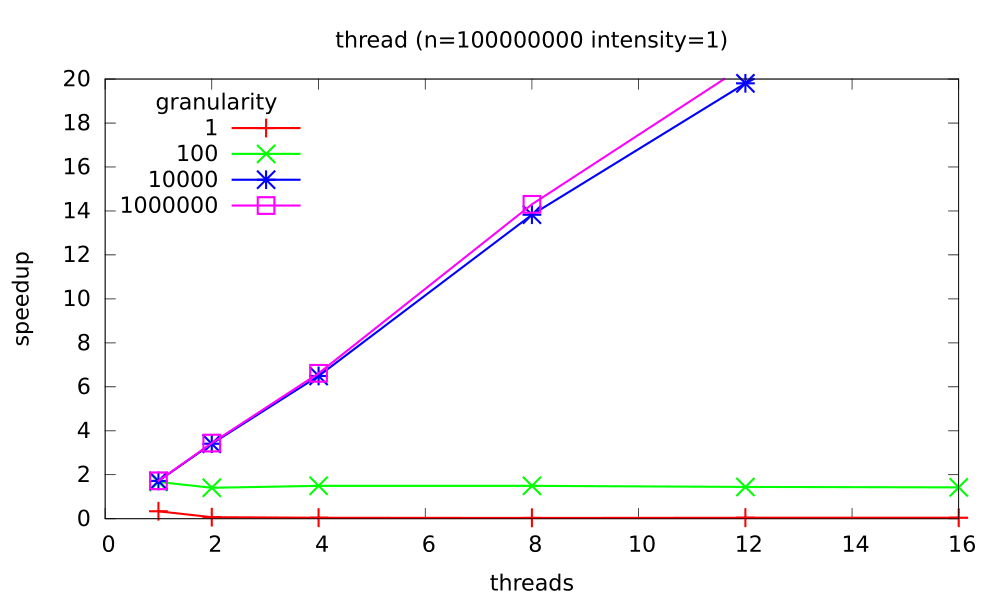

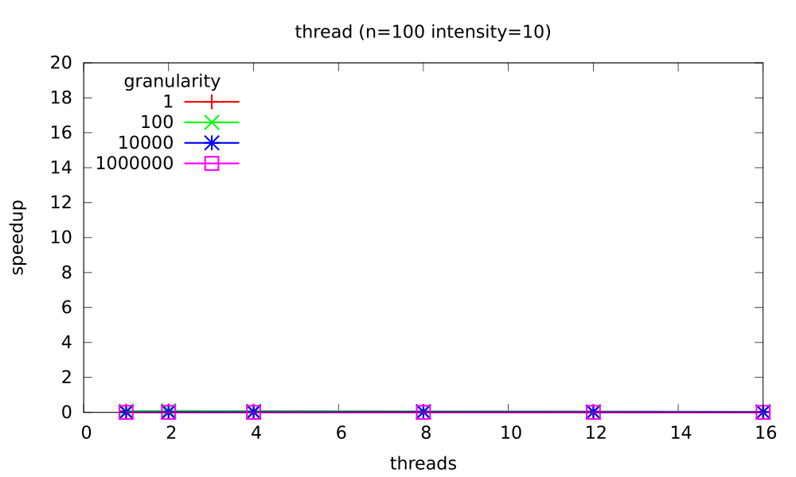
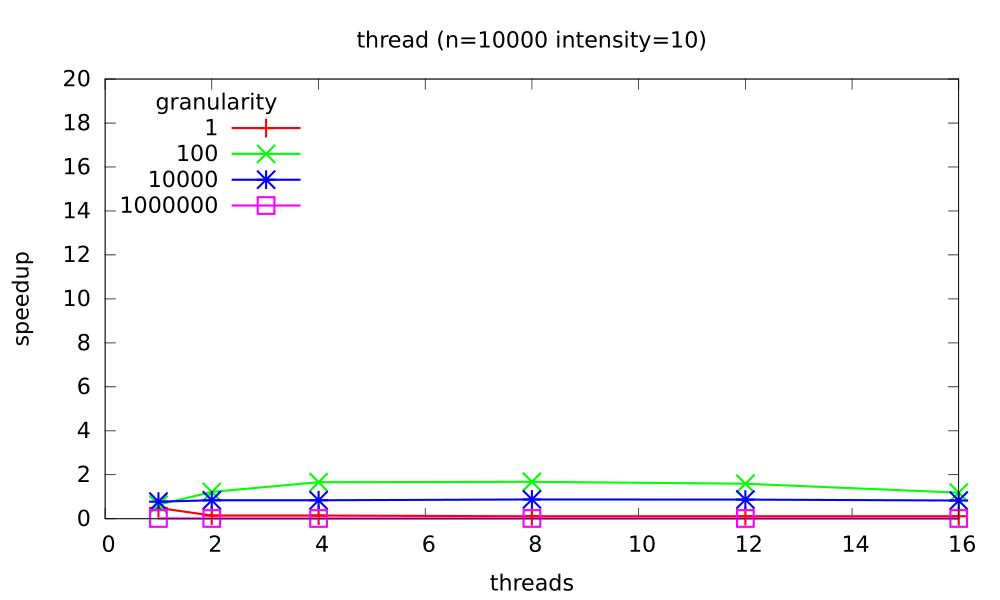
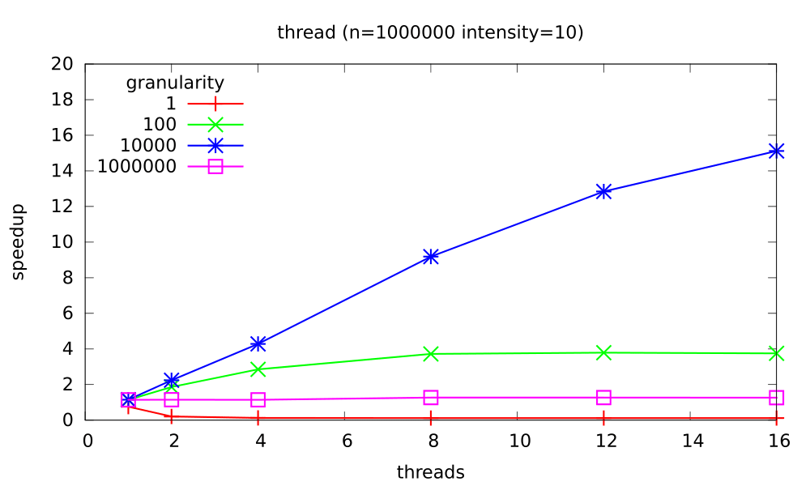
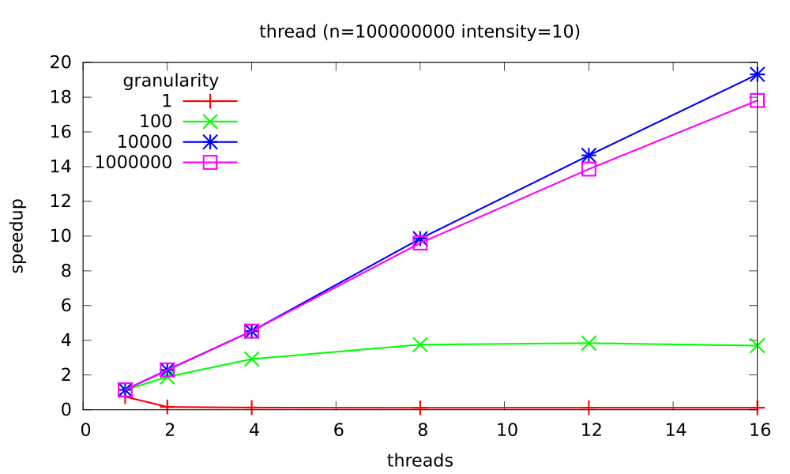
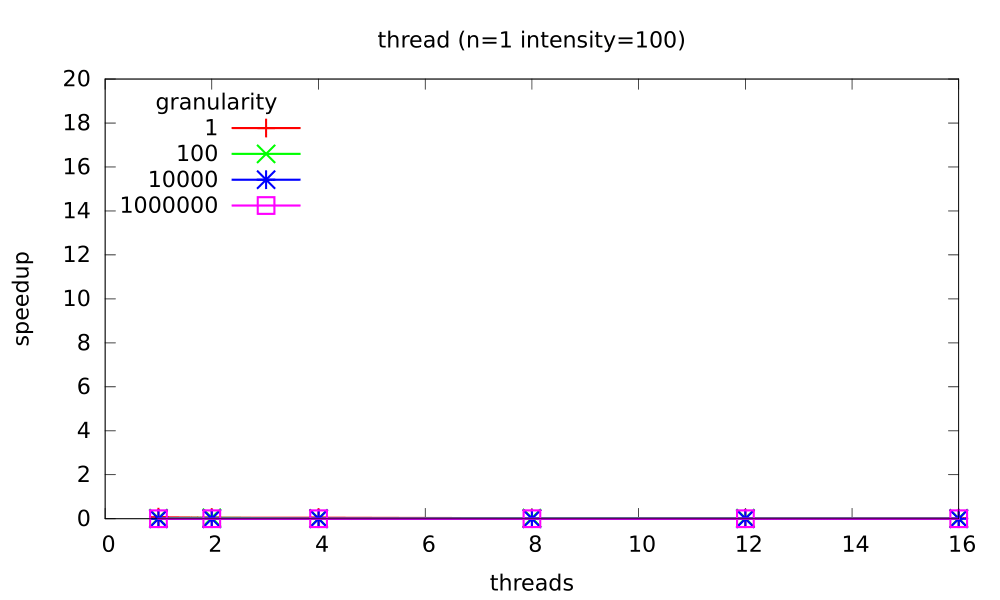
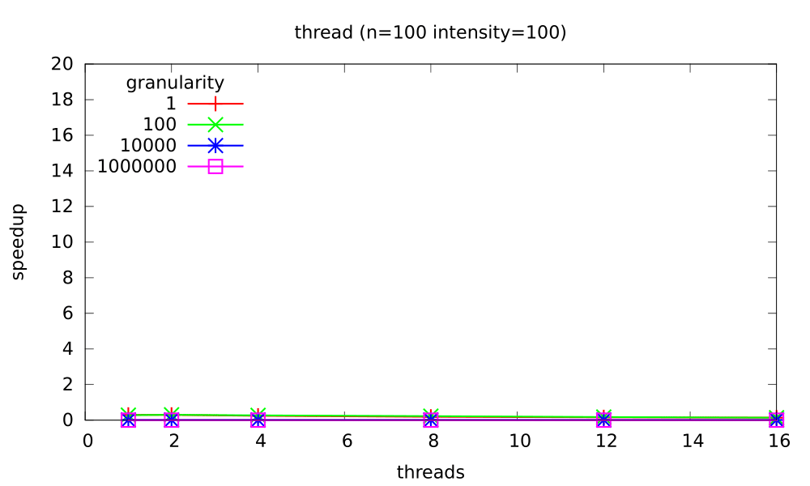

